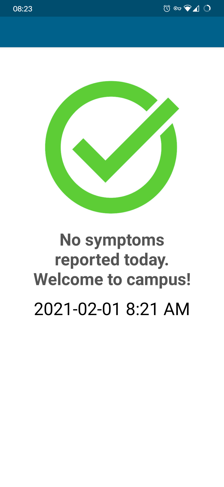

# LiveUnsafe
This app displays a checkmark screen similar to that of the LiveSafe application required to go to JMU's campus.
This app displays the green checkmark, "Welcoem to Campus!" message, and the date and time, pushed back by one minute. If you hold the application open, the date and time will not change. Closing the app out entirely will make it regenerate the timestamp on next launch. Below is a screenshot:

# Disclaimer
This app was made as a UI design challenge to create something simple and yet recognizable. This app is not intended to fool any employee of James Madison University and has no affiliation with either the University or LiveSafe. I take no responsibility for any malicious or deceitful activities. Install at your own risk.

# PRs welcome!
If you find something in this app that visually looks wrong, *please* either open an issue or submit a PR! I would love to update this app to be more accurate on different devices.
